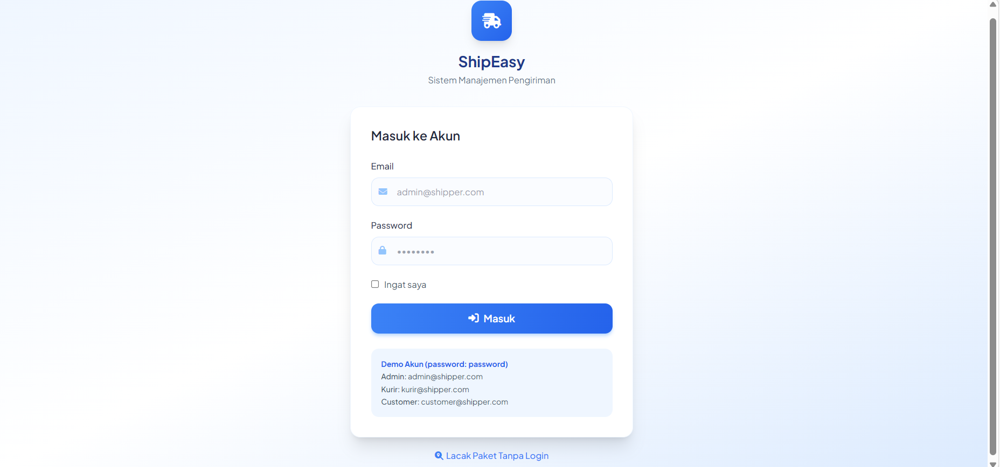
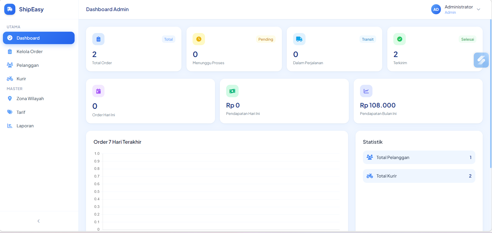
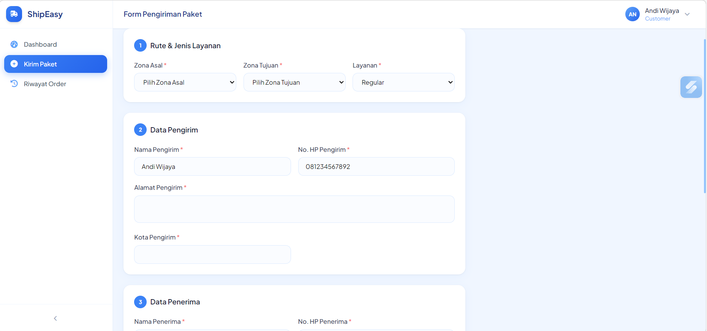

# 📦 Sistem Pengiriman Barang — ShipEasy

Aplikasi manajemen pengiriman barang berbasis web dibangun menggunakan **Laravel 12** dan **MySQL**. Mengelola seluruh alur pengiriman dari pembuatan order hingga paket sampai ke tangan penerima.

---
## 📱 Screenshots

<table>
  <tr>
    <td align="center"><strong>🔐 Login</strong></td>
    <td align="center"><strong>👨‍💼 Dashboard Admin</strong></td>
  </tr>
  <tr>
    <td></td>
    <td></td>
  </tr>
  <tr>
    <td align="center"><strong>📦 Form Kirim Paket</strong></td>
    <td align="center"><strong>🔍 Tracking Paket</strong></td>
  </tr>
  <tr>
    <td></td>
    <td></td>
  </tr>
</table>
---
## 👥 Role Pengguna

### 👨‍💼 Admin
- Dashboard statistik & grafik pengiriman
- Kelola semua order, assign kurir, update status
- Kelola data pelanggan, kurir, zona wilayah & tarif
- Laporan pengiriman harian

### 🏍️ Kurir
- Lihat daftar pengiriman yang ditugaskan
- Update status: Pickup → Dalam Perjalanan → Terkirim

### 📦 Customer
- Buat order pengiriman baru
- Kalkulasi biaya otomatis sebelum order
- Pantau riwayat & status pengiriman

---

## 📦 Alur Pengiriman
```
Customer buat order → Admin assign kurir → Kurir pickup → Paket dikirim → Terkirim ✅
```

## 🔍 Fitur Unggulan
- Nomor resi otomatis format `SHP-YYYYMMDD-XXXX`
- Kalkulasi tarif real-time berdasarkan zona & berat
- Tracking publik tanpa login via nomor resi
- Tampilan responsif — bisa diakses dari HP maupun desktop

---

## 🛠️ Tech Stack
Laravel 12 · MySQL · Tailwind CSS · Alpine.js · Chart.js
